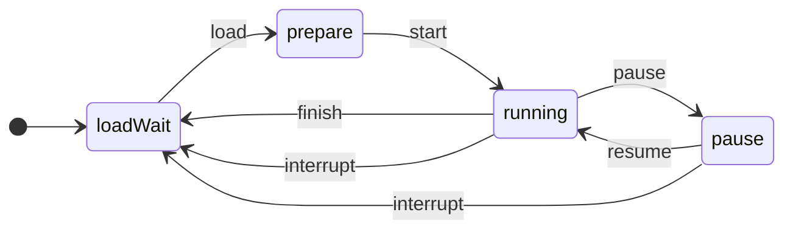

[](https://github.com/mui-z/effective-novel-core/blob/main/LICENSE)
[](https://github.com/apple/swift)

[](https://twitter.com/mui_z_)


# Effective Novel Core

This is novel text parse and provide display event stream package.

## About
This is novel engine.

This effectively helps to display the characters of the novel.　　

This library doesn't include UI layer.
This only provides parse and output stream display event. (Example of use: [EffectiveNovelReader](https://github.com/mui-z/EffectiveNovelReader))

Also, this lib is not optimized novel game, because this doesn't have if functioned, macro, subroutine.

If you use it for such a purpose, please parse it each time on the application side to use it.


## Demo
demo: [EffectiveNovelReader](https://github.com/mui-z/EffectiveNovelReader)


## Syntax
Use tags to control how they are displayed.

This syntax is based on [Tyranoscript](https://tyrano.jp/).

### Syntax Tags
Tags must be enclosed in `[]`.　　　　

When commenting out, put `#` at the beginning.  
If you want to use `#`, write `\\#`

| tag                        | DisplayEvent                      | description                                                                 |
|----------------------------|-----------------------------------|-----------------------------------------------------------------------------|
| n                          | `.newline`                        | newline                                                                     |
| tw                         | `.tapWait`                        | tap wait                                                                    |
| twn                        | `.tapWaitAndNewline`              | tap wait and newline                                                        |
| cl                         | `.clear`                          | clear                                                                       |
| sleep duration=xxxx        | `.sleep(duration: Double)`        | sleep for the specified time. duration unit is milliseconds.                |
| delay speed=xxxx           | `.delay(speed: Double)`           | change delay character displayed speed. speed unit is milliseconds.         |
| setDefaultDelay speed=xxxx | `.setDefaultDelay(speed: Double)` | change default delay character displayed speed. speed unit is milliseconds. |
| resetDelay                 | `.resetDelay`                     | reset delay speed                                                           |
| e                          | `.end`                            | stop script novel end point                                                 |


### Example Novel Script

```sample.ens
# Sample Script
tap waiting and newline[twn]

[cl] cleared text.

very fast stream after this text[delay speed=2][n]

displaying!!!!!!

[resetDelay]reset delay speed.[n]

end. [e]
```

## Usage

### State Flow



### Sample Code

```swift

// 1. get `EFNovelController` instance
let controller = EFNovelController()


// 2. load raw novel text
let result: ValidateResult<EFNovelScript, [ValidationError]> = controller.load(rawText: rawText)

let novelScript: EFNovelScript

switch result {
case .valid(let script):
    novelScript = script
case .invalid(let errors):
    print(errors)
    // handle error.
}

// 3. start() and listening stream
controller.start(script: novelScript)
          .sink { event in
              switch event {
              case .character(let char):
                  displayCharacter(char)
              // and any command handling
              }
          }
          .store(in: &cancellables)

// (4.) show text until wait tag
controller.showTextUntilWaitTag()

// (5.) pause stream.
controller.pause()

// (6.) resume from pause
// If you want to start from any index number, you can use `controller.resume(at: 100)`
controller.resume() 

// (7.) interrupt
controller.interrupt()


```

## Examples
- [ ] CUI novel reader
- [x] iOS novel reader
  - [EffectiveNovelReader](https://github.com/mui-z/EffectiveNovelReader)

## Todo
- [ ] value input
- [x] novel text validator
- [x] rearchitecture
- [ ] Swift-DocC
- [x] comment out syntax

## LICENSE
EffectiveNovelCore is licensed under the [MIT License](LICENSE)
